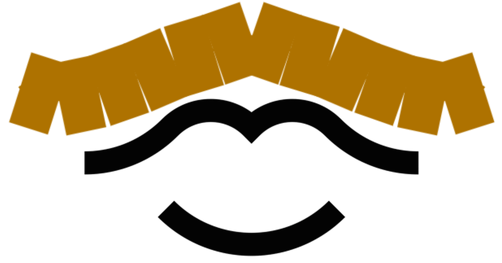

An HTML5 mustache with physics! See it in action at [http://rjsteinert.github.io/mustache/](http://rjsteinert.github.io/mustache/).  Works best when launched from Chrome for Android after adding it to your homescreen. 

Based on [Simple Spring Physics by Ghoscher](http://ghoscher.me/2013/03/02/simple-spring-physics/)
